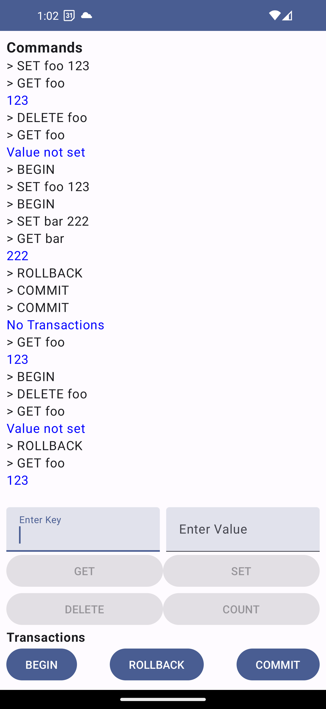

# Simple Cache App :rocket:

This is a simplified cache app built with Android Kotlin. The app allows you to store key-value pairs in a cache, and supports basic operations like `get`, `set`, `delete`, and `count`. It also supports transactions, which can be used to group multiple operations into a single, atomic operation.

## Overview and Architecture
Even though the app is simple, it is important to showcase scalability through architecture and package structure. This project is implemented using the MVVM (Model-View-ViewModel) architecture pattern with Jetpack Compose as the UI toolkit. It also follows a modular package structure that separates concerns and promotes easy maintenance and scalability. The use of ViewModel ensures that the data is persisted across configuration changes, while Jetpack Compose ensures the UI remains reactive and flexible. Overall it can be easily scaled and adapted to more complex projects.

## How to Run it on Android :wrench:
The app doesn't need any setup. It's a plug and Play :raised_hands:

## Usage :arrow_forward:
To use the app, simply enter a key-value pair and select an operation from the list of available options. The app will then perform the selected operation on the cache. Operation buttons are validated considering the key-value you enter.

## Caching Mechanism Used :nerd_face:

It's important to note that this cache is a simplified implementation, and is not intended for use in production environments. The transactional support is limited to undo operations, and does not actually provide true transactional guarantees. In addition, while the `count` operation has been optimized using a separate map, the implementation may not be the most efficient or scalable for large data sets.
This was a decision to make the solution work as fast as possible. If you look closely You'll see that the solution is extendable enough to add a true-transaction functionality without breaking any part of the code. We would only need to provide an alternative implementation to **TransactionalCache** :relieved:

## Possible Improvements :eyes: 

There are several ways in which this app could be improved, including:
-   Making the UI more visually appealing
-   Implementing a more robust transactional system that provides true transactional guarantees. 
-   Implementing more comprehensive error handling and logging to help diagnose issues. 
-   Locking mechanism to ensure that concurrent access to the cache is safe.
